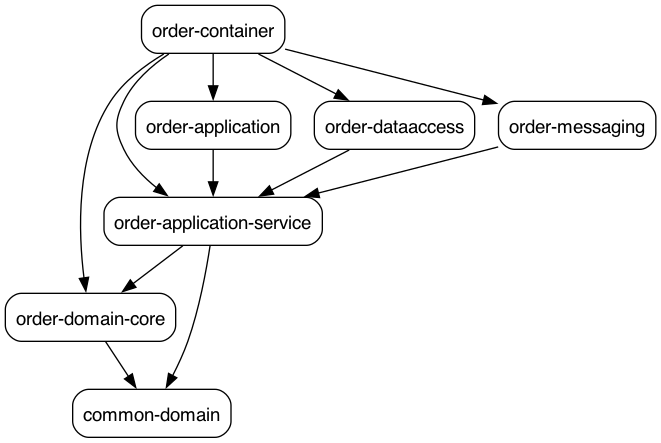

# Food Ordering System

This project demonstrates the implementation of a food ordering system using microservices with 
Clean and Hexagonal architectures, DDD, SAGA, Outbox, CQRS, Kafka, Kubernetes & Google Kubernetes
Engine (GKE).

The system is composed of the following microservices:

- Order Service
- Customer Service
- Payment Service
- Restaurant Service

## Module dependencies of the Order Service

Image below shows the module dependencies of the Order Service.



### Visualizing module dependencies with Graphviz

```
mvn com.github.ferstl:depgraph-maven-plugin:aggregate -DcreateImage=true -DreduceEdges=false -Dscope=compile "-Dincludes=space.springbok.ordering.system*:*"
```

## Setting up the environment

- Java SDK 21
- Apache Maven 3.9.0
- JetBrains IntelliJ
- Docker Desktop
- Postman
- kcat (formerly known as kafkacat)
- PostgreSQL


## Starting Kafka

### 1. Kafka - Zookeeper

cd infrastructure/docker-compose
docker compose -f common.yml -f zookeeper.yml up

To check health:
echo ruok | nc localhost 2181

### 2. Kafka - Cluster

docker compose -f common.yml -f kafka_cluster.yml up

### 3. Kafka - init

docker compose -f common.yml -f init_kafka.yml up

http://localhost:9000/

